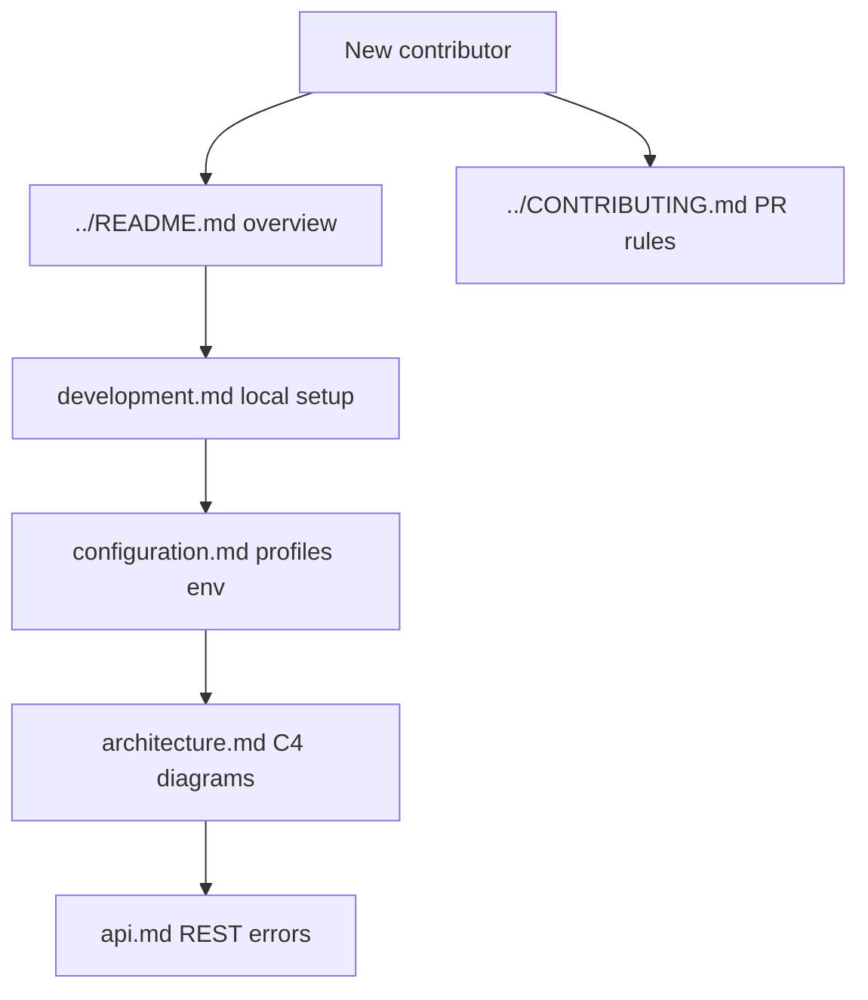

# VaultSpring documentation

Technical reference aligned with `pom.xml` and source. If a doc conflicts with code, **code wins**.

Visual approach: **Documentation as Code** — Mermaid diagrams and ADRs live in Git, reviewed in PRs ([C4 model](https://c4model.com/), [MADR](https://adr.github.io/madr/)).

## Start here

## Technical guides

| Document | Audience | Content |
| -------- | -------- | ------- |
| [architecture.md](./architecture.md) | Developers, reviewers | **C4** context/container, security, Vault |
| [configuration.md](./configuration.md) | DevOps, developers | Profile **flowchart**, env vars |
| [development.md](./development.md) | Contributors | Local + **CI pipeline** diagrams |
| [api.md](./api.md) | API consumers | Endpoints, **sequence** diagrams, RFC 7807 |
| [diagrams/README.md](./diagrams/README.md) | All | Index of all Mermaid diagrams |
| [adr/README.md](./adr/README.md) | Architects | **Why** decisions (MADR) |
| [guides/writing-style.md](./guides/writing-style.md) | All | **No gitmoji** — commits, issues, technical docs |
| [guides/attribution.md](./guides/attribution.md) | All | Author identity — no IDE co-author trailers |
| [guides/delivery-automation.md](./guides/delivery-automation.md) | All | Push / PR / tag — CI triggers and release cadence |
| [guides/git-workflow.md](./guides/git-workflow.md) | Contributors | Issue → `sandbox` → `main` → release ([ADR-0004](./adr/0004-git-branching-strategy-sandbox.md)) |
| [guides/task-kickoff.md](./guides/task-kickoff.md) | Contributors | Issue → branch traceability |
| [guides/local-runtime-authorization.md](./guides/local-runtime-authorization.md) | All | **MacBook gate** — task vs infra owner approval |
| [guides/vault-integration.md](./guides/vault-integration.md) | DevOps, developers | Vault init, Database Engine seed, Compose flow |
| [guides/releases.md](./guides/releases.md) | Maintainers | SemVer, tags, CHANGELOG |
| [guides/portfolio-ecosystem.md](./guides/portfolio-ecosystem.md) | All | Portfolio context — AIOS reference, local SSOT |
| [guides/github-agents.md](./guides/github-agents.md) | Contributors | Copilot custom agents catalog |
| [guides/github-projects.md](./guides/github-projects.md) | Maintainers | Projects v2 schema and release train |
| [guides/github-wiki-policy.md](./guides/github-wiki-policy.md) | All | Wiki disabled / stub — docs in Git are SSOT |
| [prompts/README.md](./prompts/README.md) | All | **PKB** — catalog, intake, reusable prompts |

## Prompt Knowledge Base (PKB)

Reusable analysis prompts (Docs-as-Code). Intake triggers: `PKB intake` · `catalogar prompt` · `guardar prompt` — see [`prompts/README.md`](./prompts/README.md).

| Domain | Examples |
| ------ | -------- |
| `documentation` | README/hub audit, docs ↔ code alignment |
| `security` | JWT review (#6), AppSec checklist |
| `spring-boot` | Integration tests, Flyway |
| `delivery` | Release readiness, SemVer gate |

Catalog: [`prompts/index.yaml`](./prompts/index.yaml) · Drift check: `bash scripts/check-pkb-inventory.sh`

## Diátaxis map (where to look)

| Diátaxis quadrant | VaultSpring paths |
| ----------------- | ----------------- |
| **Tutorial** (learning-oriented) | [development.md](./development.md) — first local run |
| **How-to** (task-oriented) | [guides/](./guides/) — git, releases, Vault, delivery |
| **Reference** (information-oriented) | [configuration.md](./configuration.md), [api.md](./api.md), [adr/](./adr/) |
| **Explanation** (understanding-oriented) | [architecture.md](./architecture.md), ADRs, [observability/01-architecture.md](./observability/01-architecture.md) |

Folder names are historical; this table is the navigation index. A full rename to `tutorials/` / `how-to/` is deferred — see issue [#97](https://github.com/KleilsonSantos/VaultSpring/issues/97).

## Root docs

| File | Purpose |
| ---- | ------- |
| [../README.md](../README.md) | Project overview and badges |
| [../HELP.md](../HELP.md) | Quick start (links here for depth) |
| [../CONTRIBUTING.md](../CONTRIBUTING.md) | Contribution and CI gates |
| [../CHANGELOG.md](../CHANGELOG.md) | Version history |
| [../SECURITY.md](../SECURITY.md) | Vulnerability reporting and repo posture |
| [../AGENTS.md](../AGENTS.md) | AI assistant routing (author: Kleilson Santos) |
| [../CHECKLISTAPPSEC.md](../CHECKLISTAPPSEC.md) | Manual AppSec checklist (no PoCs) |

## Stack snapshot (verify in `pom.xml`)

- Java **17**, Spring Boot **3.5.16**, Spring Cloud **2025.0.3**
- PostgreSQL **15**, Flyway, HashiCorp Vault (Database Secrets Engine via Spring Cloud Vault Config)
- Spring Security `SecurityFilterChain` + JWT Bearer (`AuthController`, `JwtService`) — issue [#6](https://github.com/KleilsonSantos/VaultSpring/issues/6)
- springdoc OpenAPI **2.9.0**, Testcontainers, JaCoCo, Checkstyle
