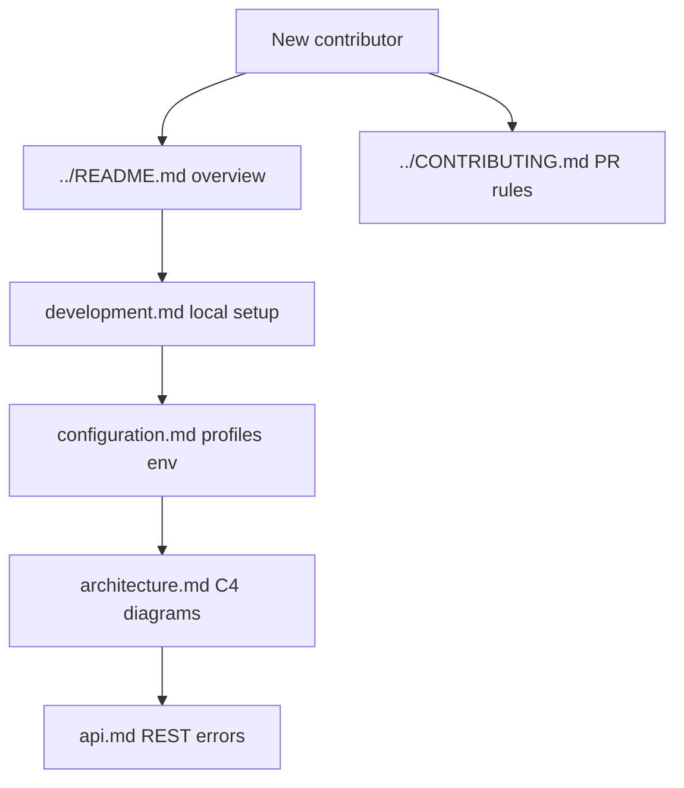

# VaultSpring documentation

Technical reference aligned with `pom.xml` and source. If a doc conflicts with code, **code wins**.

Visual approach: **Documentation as Code** — Mermaid diagrams and ADRs live in Git, reviewed in PRs ([C4 model](https://c4model.com/), [MADR](https://adr.github.io/madr/)).

## Start here

## Technical guides

| Document | Audience | Content |
| -------- | -------- | ------- |
| [architecture.md](./architecture.md) | Developers, reviewers | **C4** context/container, security, Vault |
| [configuration.md](./configuration.md) | DevOps, developers | Profile **flowchart**, env vars |
| [development.md](./development.md) | Contributors | Local + **CI pipeline** diagrams |
| [api.md](./api.md) | API consumers | Endpoints, **sequence** diagrams, RFC 7807 |
| [diagrams/README.md](./diagrams/README.md) | All | Index of all Mermaid diagrams |
| [adr/README.md](./adr/README.md) | Architects | **Why** decisions (MADR) |
| [guides/git-workflow.md](./guides/git-workflow.md) | Contributors | Issue → PR → release |
| [guides/task-kickoff.md](./guides/task-kickoff.md) | Contributors | Issue → branch traceability |
| [guides/releases.md](./guides/releases.md) | Maintainers | SemVer, tags, CHANGELOG |

## Root docs

| File | Purpose |
| ---- | ------- |
| [../README.md](../README.md) | Project overview and badges |
| [../HELP.md](../HELP.md) | Quick start (links here for depth) |
| [../CONTRIBUTING.md](../CONTRIBUTING.md) | Contribution and CI gates |
| [../CHANGELOG.md](../CHANGELOG.md) | Version history |
| [../SECURITY.md](../SECURITY.md) | Vulnerability reporting and repo posture |
| [../AGENTS.md](../AGENTS.md) | AI agent routing (Cursor, Copilot) |
| [../CHECKLISTAPPSEC.md](../CHECKLISTAPPSEC.md) | Manual AppSec checklist (no PoCs) |

## Stack snapshot (verify in `pom.xml`)

- Java **17**, Spring Boot **3.5.16**, Spring Cloud **2025.0.3**
- PostgreSQL **15**, Flyway, HashiCorp Vault (KV v2 via Spring Cloud Vault Config)
- Spring Security `SecurityFilterChain` (JWT planned — issue #6)
- springdoc OpenAPI **2.9.0**, Testcontainers, JaCoCo, Checkstyle
