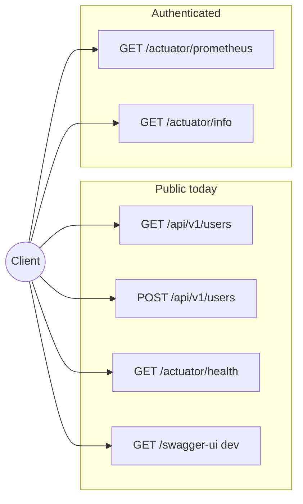
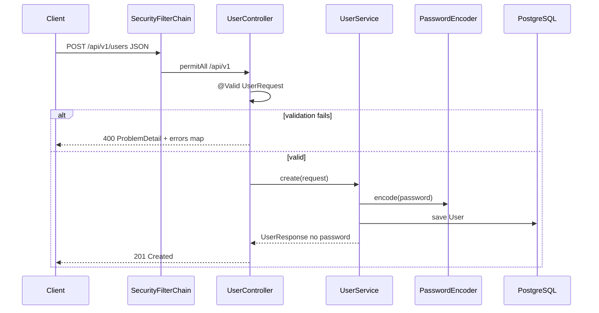

# HTTP API

Base path: **`/api/v1`**. OpenAPI spec generated by springdoc (dev profile only).

## API surface (overview)



## OpenAPI / Swagger

| Profile | Swagger UI | OpenAPI JSON |
| ------- | ---------- | ------------ |
| `dev` | http://localhost:8080/swagger-ui.html | http://localhost:8080/v3/api-docs |
| `prod` / `hom` | Disabled (`springdoc.*.enabled: false`) | N/A |

Configuration: `OpenApiConfig`, `application-dev.yml`.

## Users

### List users

```http
GET /api/v1/users
```

**Response** `200 OK`

```json
[
  {
    "id": 1,
    "name": "Alice",
    "email": "alice@example.com"
  }
]
```

Passwords are never returned.

### Create user

```http
POST /api/v1/users
Content-Type: application/json

{
  "name": "Alice",
  "email": "alice@example.com",
  "password": "secret-min-8-chars"
}
```

**Response** `201 Created` — body is `UserResponse` (no password field).

Validation (`UserRequest`):

- `name`: required, 3–50 characters  
- `email`: required, valid email, max 100  
- `password`: required, 8–72 characters (stored as BCrypt hash)  

### Create user (sequence)



## Error responses (RFC 7807)

`GlobalExceptionHandler` returns `application/problem+json` (`ProblemDetail`).

### Validation error (400)

```json
{
  "type": "about:blank",
  "title": "Invalid request",
  "status": 400,
  "detail": "Validation failed",
  "errors": {
    "email": "must be a well-formed email address"
  }
}
```

### Application errors

`ResponseStatusException` from services maps to the same status with `title` and `detail` set.

## Actuator

| Endpoint | Auth (current) | Notes |
| -------- | -------------- | ----- |
| `GET /actuator/health` | None | Render health check |
| `GET /actuator/info` | HTTP Basic | Build/git info when configured |
| `GET /actuator/prometheus` | HTTP Basic | Micrometer Prometheus scrape |

JWT for API and actuator hardening: issue [#6](https://github.com/KleilsonSantos/VaultSpring/issues/6).

## Example (curl)

```bash
curl -s http://localhost:8080/actuator/health | jq .

curl -s -X POST http://localhost:8080/api/v1/users \
  -H 'Content-Type: application/json' \
  -d '{"name":"Bob","email":"bob@example.com","password":"changeme1"}' | jq .
```

## Security testing

Manual checklist: [../CHECKLISTAPPSEC.md](../CHECKLISTAPPSEC.md). Do not commit exploit payloads or scan results with secrets.
