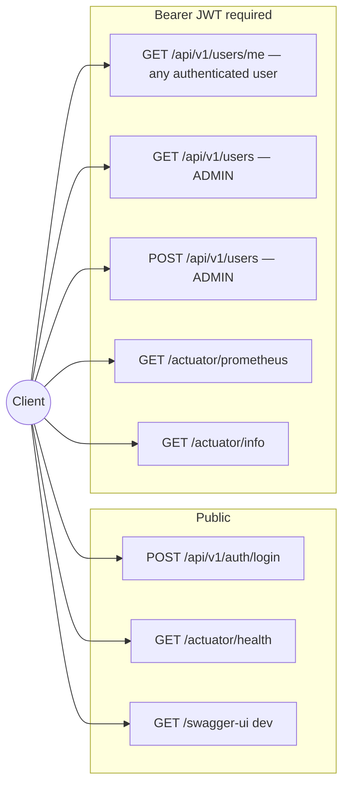
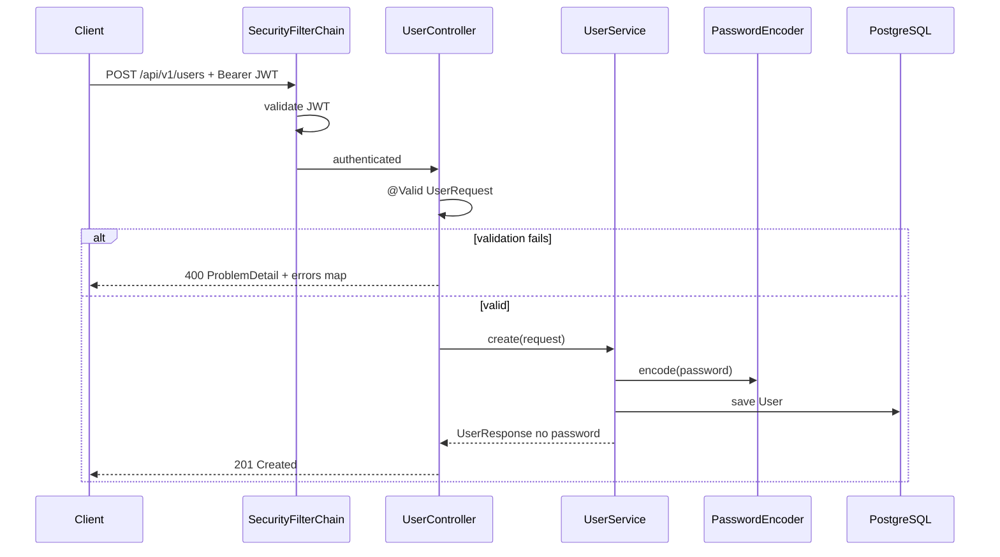

# HTTP API

Base path: **`/api/v1`**. OpenAPI spec generated by springdoc (dev profile).

## API surface (overview)



## Authentication

1. `POST /api/v1/auth/login` with email + password (public).
2. Use `Authorization: Bearer <accessToken>` on protected routes.

Dev seed users (after Flyway): `john@example.com` / `secret123` (**ADMIN**) — see [`development.md`](./development.md).

## Authorization (RBAC)

| Role | Routes |
| ---- | ------ |
| **USER** | `GET /api/v1/users/me`, actuator (when authenticated) |
| **ADMIN** | All USER routes plus `GET /api/v1/users`, `POST /api/v1/users` |

Roles are stored on the user record, embedded in the JWT `roles` claim, and enforced by Spring Security (`hasRole("ADMIN")`). New users created via the API receive role **USER** by default.

**Errors:** `403 Forbidden` when a valid JWT lacks the required role.

## OpenAPI / Swagger

| Profile | Swagger UI | OpenAPI JSON |
| ------- | ---------- | ------------ |
| `dev` | http://localhost:8080/swagger-ui.html | http://localhost:8080/v3/api-docs |
| `prod` / `hom` | Disabled (`springdoc.*.enabled: false`) | N/A |

Login is **public** in OpenAPI (`security: []` on `POST /api/v1/auth/login`). Other routes use `bearerAuth`.

Configuration: `OpenApiConfig`, `AuthController`, `application-dev.yml`.

## Auth — login

```http
POST /api/v1/auth/login
Content-Type: application/json

{
  "email": "john@example.com",
  "password": "secret123"
}
```

**Response** `200 OK`

```json
{
  "accessToken": "<JWT>",
  "tokenType": "Bearer",
  "expiresIn": 3600
}
```

**Errors:** `401` invalid credentials · `400` validation (RFC 7807).

## Users

All user routes require a valid JWT. List and create require role **ADMIN**; any authenticated user may read their own profile.

### Current user profile

```http
GET /api/v1/users/me
Authorization: Bearer <accessToken>
```

**Response** `200 OK` — `UserResponse` for the JWT subject (email).

**Errors:** `401` missing/invalid JWT.

### List users (admin)

```http
GET /api/v1/users
Authorization: Bearer <accessToken>
```

**Response** `200 OK` — array of `UserResponse` (no password field).

**Errors:** `401` with JSON body (`Bearer token required` or `invalid or expired bearer token`) · `403` when JWT is valid but caller is not ADMIN.

### Create user (admin)

```http
POST /api/v1/users
Authorization: Bearer <accessToken>
Content-Type: application/json

{
  "name": "Alice",
  "email": "alice@example.com",
  "password": "secret-min-8-chars"
}
```

**Response** `201 Created` — body is `UserResponse` (role **USER**).

Validation (`UserRequest`):

- `name`: required, 3–50 characters  
- `email`: required, valid email, max 100  
- `password`: required, 8–72 characters (stored as BCrypt hash)  

**Errors:** `403` when caller is not ADMIN.

### Create user (sequence)



## Error responses (RFC 7807)

`GlobalExceptionHandler` and security entry points return `application/problem+json` (`ProblemDetail`).

### Validation error (400)

```json
{
  "type": "about:blank",
  "title": "Invalid request",
  "status": 400,
  "detail": "Validation failed",
  "errors": {
    "email": "must be a well-formed email address"
  }
}
```

### Forbidden (403)

Valid JWT but insufficient role (e.g. USER calling admin-only routes):

```json
{
  "type": "about:blank",
  "title": "Forbidden",
  "status": 403,
  "detail": "Access Denied"
}
```

### Unauthorized (401)

Missing or invalid JWT:

```json
{
  "type": "about:blank",
  "title": "Unauthorized",
  "status": 401,
  "detail": "Bearer token required",
  "instance": "/api/v1/users"
}
```

Login failure: `"detail": "invalid credentials"`.

### Application errors

`ResponseStatusException` from services maps to the same status with `title` and `detail` set (e.g. `409` duplicate email).

## Actuator

| Endpoint | Auth | Notes |
| -------- | ---- | ----- |
| `GET /actuator/health` | None | Liveness/readiness |
| `GET /actuator/info` | Bearer JWT | Build/git info when configured |
| `GET /actuator/prometheus` | Bearer JWT | Micrometer Prometheus scrape |

## Example (curl)

```bash
# Health (public)
curl -s http://localhost:8080/actuator/health | jq .

# Login (admin seed user)
TOKEN=$(curl -s -X POST http://localhost:8080/api/v1/auth/login \
  -H 'Content-Type: application/json' \
  -d '{"email":"john@example.com","password":"secret123"}' | jq -r .accessToken)

# Current user profile (any authenticated user)
curl -s http://localhost:8080/api/v1/users/me -H "Authorization: Bearer $TOKEN" | jq .

# List users (admin)
curl -s http://localhost:8080/api/v1/users -H "Authorization: Bearer $TOKEN" | jq .

# Create user (admin)
curl -s -X POST http://localhost:8080/api/v1/users \
  -H "Authorization: Bearer $TOKEN" \
  -H 'Content-Type: application/json' \
  -d '{"name":"Bob","email":"bob@example.com","password":"changeme1"}' | jq .
```

Live smoke script: `bash scripts/api-live-smoke.sh` (app must be running).

## Postman (optional regression layer)

Import from [`tests/api/postman/`](../tests/api/postman/README.md):

- **Collection:** `VaultSpring - Smoke Tests` — mirrors the curl smoke flow (health, 401, login, users).
- **Environment:** `VaultSpring - Local` — `base_url`, seed credentials, `access_token` (set by login request).

Postman is for **manual audit and regression**; it is **not** a merge-blocking CI gate. Required gates remain `./mvnw test` and (when applicable) `api-live-smoke.sh` / Testcontainers IT.

## Security testing

Manual checklist: [../CHECKLISTAPPSEC.md](../CHECKLISTAPPSEC.md). Do not commit exploit payloads or scan results with secrets.
