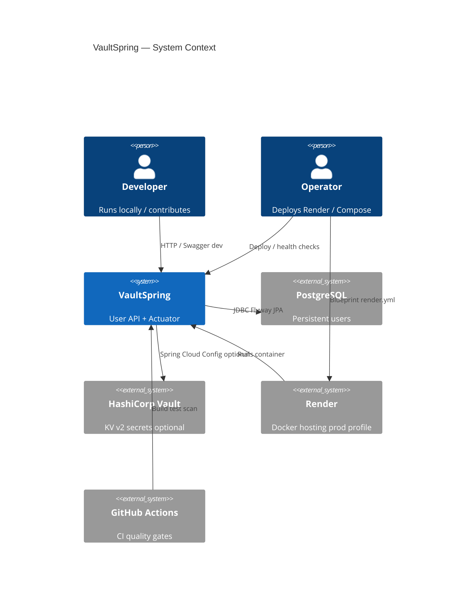
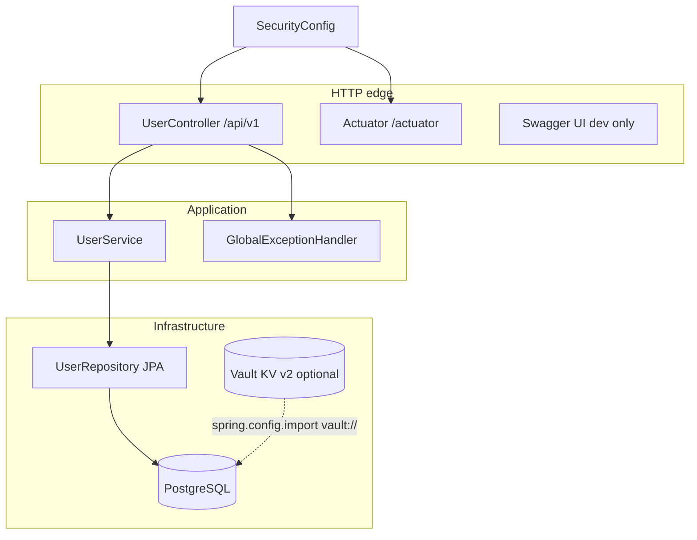
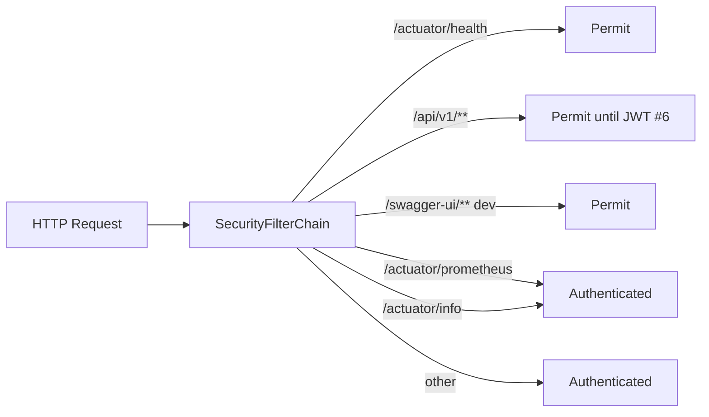
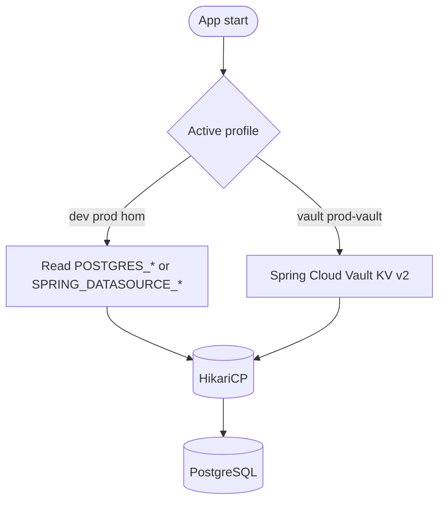

# Architecture

VaultSpring is a single Spring Boot service for user management with credentials stored hashed (BCrypt) and datasource secrets sourced from the environment or HashiCorp Vault.

> **Visual docs:** Mermaid diagrams render on GitHub. Index: [diagrams/README.md](./diagrams/README.md). Decisions: [adr/README.md](./adr/README.md).

## C4 — Context (level 1)

Who uses the system and what it talks to.



## C4 — Container (level 2)

Major deployable / runtime pieces.

```mermaid
C4Container
  title VaultSpring — Containers
  Person(client, "API Client", "curl / Postman / future SPA")

  Container_Boundary(vs, "VaultSpring JVM") {
    Container(web, "Spring MVC", "UserController Actuator")
    Container(sec, "SecurityFilterChain", "SecurityConfig")
    Container(svc, "UserService", "BCrypt business rules")
    Container(jpa, "Spring Data JPA", "UserRepository")
  }

  ContainerDb(db, "PostgreSQL 15", "users_db Flyway schema")
  Container_Ext(vault, "Vault", "secret/vaultspring")
  Container_Ext(prom, "Prometheus", "Scrapes /actuator/prometheus")

  Rel(client, web, "HTTPS JSON")
  Rel(web, sec, "Filter chain")
  Rel(web, svc, "DTO in/out")
  Rel(svc, jpa, "Entity User")
  Rel(jpa, db, "SQL")
  Rel(vs, vault, "vault:// import", "optional")
  Rel(prom, web, "Scrape auth", "Basic today")
```

## Component flow (level 3 — simplified)



## Java packages (`com.vaultspring`)

| Package | Responsibility |
| ------- | -------------- |
| `controller` | REST adapters (`UserController` under `/api/v1`) |
| `dto` | `UserRequest` / `UserResponse` — password never in responses |
| `service` | Application rules, BCrypt via `PasswordEncoder` |
| `entity` / `repository` | JPA `User` entity and Spring Data |
| `config` | `SecurityConfig`, `OpenApiConfig` |
| `exception` | RFC 7807 `ProblemDetail` via `GlobalExceptionHandler` |

Configuration lives in `src/main/resources/` (`application*.yml`), not in Java packages.

## Security model (current)



Implemented in `SecurityConfig`:

| Path | Access |
| ---- | ------ |
| `/actuator/health`, `/actuator/health/**` | Public |
| `/api/v1/**` | Public (JWT login tracked in [#6](https://github.com/KleilsonSantos/VaultSpring/issues/6)) |
| `/swagger-ui/**`, `/v3/api-docs/**` | Public (disabled in prod via springdoc) |
| `/actuator/prometheus`, `/actuator/info` | Authenticated (HTTP Basic for now) |
| Other | Authenticated |

- CSRF disabled (stateless API baseline)
- CORS on `/api/**` (localhost origins)
- HSTS when `prod` profile is active
- `PasswordEncoder`: BCrypt strength 10

ADR: [0003-security-filter-chain-before-jwt.md](./adr/0003-security-filter-chain-before-jwt.md)

## Secrets and datasource



Two supported paths:

1. **Environment** — profile `prod` / `dev`: `SPRING_DATASOURCE_*` or `POSTGRES_*` (see [configuration.md](./configuration.md)).
2. **Vault** — profiles `vault` or group `prod-vault`: Spring Cloud Vault Config imports `vault://`, KV v2 path `secret/vaultspring` (seed via `scripts/vault-seed-dev.sh`).

ADR: [0002-datasource-via-vault-or-env.md](./adr/0002-datasource-via-vault-or-env.md)

Vault in Docker Compose is **local infrastructure**; tokens and unseal keys never belong in Git.

## Database

- PostgreSQL **15** (Compose and Testcontainers)
- Schema via **Flyway** (`src/main/resources/db/migration/`)
- JPA `ddl-auto: validate` in dev/prod (no Hibernate auto-DDL in production paths)

## Build artifact

- Maven `finalName`: `app` → `target/app.jar`
- Multi-stage `Dockerfile` copies that JAR
- Render blueprint (`render.yml`): Docker deploy, profile `prod`, health at `/actuator/health`

## Out of scope (do not document as shipped)

- JWT authentication ([#6](https://github.com/KleilsonSantos/VaultSpring/issues/6))
- Spring Boot 4 migration ([#33](https://github.com/KleilsonSantos/VaultSpring/issues/33))
- MapStruct (not in `pom.xml`)
