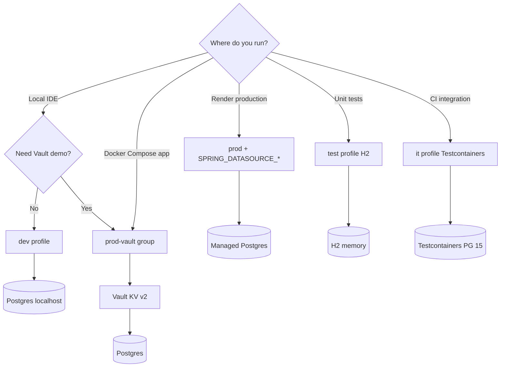

# Configuration

Spring Boot configuration files: `src/main/resources/application*.yml`. Default profile: **`dev`** (`spring.profiles.default` in `application.yml`).

## Profile selection flow



## Profile reference

| Profile / group | Purpose | Datasource | Vault | OpenAPI |
| --------------- | ------- | ---------- | ----- | ------- |
| `dev` (default) | Local development | `POSTGRES_*` env / defaults | Off | Enabled (`/swagger-ui.html`) |
| `prod` | Production / Render | `SPRING_DATASOURCE_*` | Off | Disabled |
| `hom` | Homologation | Same pattern as prod | Off | Disabled |
| `vault` | Vault-backed JDBC | From Vault KV v2 | On | Follows active doc profile |
| `prod-vault` | **Group**: `prod` + `vault` | Vault | On | Disabled (prod springdoc) |
| `test` | Unit tests (H2) | In-memory H2 | Off | N/A |
| `it` | Integration tests | Testcontainers PostgreSQL | Off | N/A |

Activate explicitly:

```bash
./mvnw spring-boot:run -Dspring-boot.run.profiles=dev
export SPRING_PROFILES_ACTIVE=prod-vault   # Compose app service default
```

## Environment variables

Copy [`.env.example`](../.env.example) to `.env` (never commit `.env`).

### PostgreSQL (Compose / dev)

| Variable | Example | Used by |
| -------- | ------- | ------- |
| `POSTGRES_DB` | `users_db` | Compose postgres |
| `POSTGRES_USER` | `admin` | Compose, dev profile |
| `POSTGRES_PASSWORD` | `adminpass` | Compose, dev profile |
| `POSTGRES_URL` | `jdbc:postgresql://localhost:5432/users_db` | dev datasource |

### Production (Render / prod profile)

| Variable | Notes |
| -------- | ----- |
| `SPRING_DATASOURCE_URL` | JDBC URL (required in prod) |
| `SPRING_DATASOURCE_USERNAME` | DB user |
| `SPRING_DATASOURCE_PASSWORD` | DB password |
| `SPRING_PROFILES_ACTIVE` | `prod` on Render (`render.yml`) |

### HashiCorp Vault

| Variable | Notes |
| -------- | ----- |
| `VAULT_ADDR` | Default `http://127.0.0.1:8200` |
| `VAULT_TOKEN` | App or root token after init/unseal — **secret** |
| `SPRING_PROFILES_ACTIVE` | `prod-vault` for Compose app with Vault |

Vault KV v2 (see `application-vault.yml`):

- Backend: `secret`
- Application context: `vaultspring` → path `secret/vaultspring`
- Expected keys (after `scripts/vault-seed-dev.sh`): `spring.datasource.url`, `username`, `password`

### Optional local tooling

| Variable | Purpose |
| -------- | ------- |
| `SONAR_TOKEN` / `SONAR_HOST_URL` | Local SonarQube (`make sonar`) |
| `NVD_API_KEY` | OWASP Dependency-Check profile |

## Actuator

Exposed in `application.yml`:

- `health` — public (also Kubernetes probes enabled)
- `info` — authenticated
- `prometheus` — authenticated

Prometheus export enabled via Micrometer.

## Maven profiles (build-time)

| Profile | Command | Effect |
| ------- | ------- | ------ |
| `integration-tests` | `./mvnw verify -Pintegration-tests` | Runs `*IT.java` via Failsafe + Testcontainers |
| `flyway-dev` | `./mvnw flyway:migrate -Pflyway-dev` | Flyway against local Postgres |
| `flyway-prod` | `./mvnw flyway:migrate -Pflyway-prod` | Flyway with env-provided JDBC props |
| `dependency-check` | `./mvnw verify -Pdependency-check` | OWASP Dependency-Check (optional, local/scheduled) |

## Test configuration

- `src/test/resources/application-test.yml` — H2, Vault disabled
- `src/test/resources/application-it.yml` — Testcontainers service connection, Vault disabled
