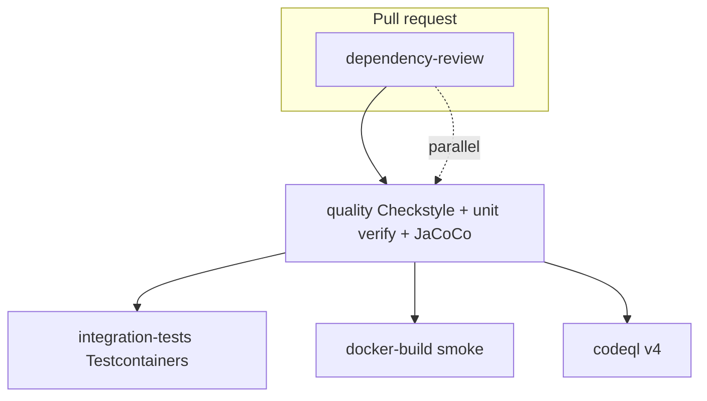

# Development guide

## Prerequisites

- Java **17+**
- Docker + Docker Compose (PostgreSQL, Vault, integration tests)
- Git

Use the **Maven Wrapper** (`./mvnw`) — do not assume a global Maven install.

## Local development flow

```mermaid
flowchart LR
  A[git clone] --> B[cp .env.example .env]
  B --> C[docker compose up postgres]
  C --> D[./mvnw spring-boot:run dev]
  D --> E{Smoke test}
  E --> F[/swagger-ui.html]
  E --> G[/actuator/health]
  E --> H[POST /api/v1/users]
```

## CI pipeline overview

Runs on every push/PR to **`main`** and **`sandbox`** (`.github/workflows/maven.yml`); SemVer gate only on `main`:



Also: SonarCloud Automatic Analysis, GitGuardian (PR checks).

## Quick start (dev, Postgres only)

```bash
git clone https://github.com/KleilsonSantos/VaultSpring.git
cd VaultSpring
cp .env.example .env   # adjust if needed

docker compose up -d postgres
./mvnw spring-boot:run -Dspring-boot.run.profiles=dev
```

- API: http://localhost:8080/api/v1/users  
- Swagger UI (dev): http://localhost:8080/swagger-ui.html  
- Health: http://localhost:8080/actuator/health  

### Dev seed users (Flyway)

After migrations, log in with any seeded account:

| Email | Password |
| ----- | -------- |
| `john@example.com` | `secret123` |
| `jane@example.com` | `secret123` |

(V3 migration aligns legacy seed hashes to `secret123`.)

Live smoke (app must be running on `:8080`):

```bash
bash scripts/api-live-smoke.sh
```

Postman (optional — same scenarios as smoke script): import [`tests/api/postman/`](../tests/api/postman/README.md). **Not blocking** for commit/merge if Collections are absent or stale; Maven + smoke script are the gates.

## Test layers (audit flow)

| Layer | Command / artifact | Merge-blocking? |
| ----- | ------------------ | --------------- |
| Unit + embedded HTTP | `./mvnw -B checkstyle:check test` | **Yes** |
| Integration (Docker) | `bash scripts/run-integration-tests.sh` | **Yes** when API/DB touched |
| Live curl smoke | `bash scripts/api-live-smoke.sh` | **Yes** when live proof required |
| Postman Collection Runner | `tests/api/postman/collections/` | **No** — regression / audit aid |

## Quick start (Compose + Vault)

```bash
cp .env.example .env
docker compose up -d postgres vault
# Init/unseal Vault — operational steps per HashiCorp docs; set VAULT_TOKEN in .env
bash scripts/vault-seed-dev.sh
docker compose up -d app    # SPRING_PROFILES_ACTIVE=prod-vault by default
```

Details: [configuration.md](./configuration.md).

## Common commands

### Maven

```bash
./mvnw -B checkstyle:check test          # unit tests (34 tests, H2)
./mvnw -B verify -Pintegration-tests     # + UserApiIT (requires Docker)
./mvnw -B verify                         # unit + JaCoCo report
```

### Makefile targets

| Target | Action |
| ------ | ------ |
| `make test-unit` | Surefire unit tests |
| `make test-it` | Failsafe integration profile |
| `make test-all` | Unit + integration verify |
| `make run-dev` | `./mvnw spring-boot:run` with `dev` profile |
| `make coverage` | JaCoCo report → `target/site/jacoco/` |
| `make sonar` | Local Sonar scan (needs SonarQube + `SONAR_TOKEN`) |
| `make check-sec` | OWASP Dependency-Check Maven profile |

### Scripts

| Script | Purpose |
| ------ | ------- |
| `scripts/task-kickoff.sh <issue> <branch>` | Branch from `sandbox` + issue comment |
| `scripts/bootstrap-sandbox.sh` | One-time create remote `sandbox` from `main` |
| `scripts/check-pr-issue-link.sh` | CI: require `Refs #N` on PRs → `sandbox` |
| `scripts/check-pr-delivery-gate.sh` | **Local** parity for `issue-link` — run before push |
| `scripts/pre-push-check.sh` | **Local** full gate: delivery + observability configs + Maven `quality` |
| `scripts/check-pr-delivery-gate-selftest.sh` | Regression tests for delivery gate |
| `scripts/install-hooks.sh` | Enable `.githooks/` (Conventional Commits) |
| `scripts/check-semver-alignment.sh` | Release gate (CI on `main`) |
| `scripts/vault-seed-dev.sh` | Seed Vault KV for local JDBC |
| `scripts/act-dev.sh` | Run GitHub Actions locally with `act` |

## Docker image

```bash
./mvnw -B package -DskipTests
docker build -t vaultspring:local .
docker run -p 8080:8080 -e SPRING_PROFILES_ACTIVE=prod \
  -e SPRING_DATASOURCE_URL=... -e SPRING_DATASOURCE_USERNAME=... \
  -e SPRING_DATASOURCE_PASSWORD=... vaultspring:local
```

CI runs the same `docker build` smoke on every PR (`docker-build` job).

## Testing layout

| Type | Location | Runner |
| ---- | -------- | ------ |
| Unit | `*Test.java` | Surefire, profile `test` |
| Integration | `*IT.java` | Failsafe, profile `it`, Testcontainers |
| Security smoke | `SecurityFilterChainTest` | MockMvc |

Coverage: JaCoCo on `verify`; Codecov uploads from CI (non-blocking).

## Git hooks (recommended)

```bash
bash scripts/install-hooks.sh
```

- `commit-msg`: Conventional Commits; blocks IDE co-author trailers  
- `pre-commit`: prompts pom version bump when `pom.xml` is staged  

## Delivery flow

New work: GitHub issue → `scripts/task-kickoff.sh` → PR `Refs #N` → **`sandbox`** → promote PR `Closes #N` → **`main`**.

See [guides/git-workflow.md](./guides/git-workflow.md) and [../CONTRIBUTING.md](../CONTRIBUTING.md).

## Troubleshooting

| Symptom | Check |
| ------- | ----- |
| DB connection refused | `docker compose ps`, `POSTGRES_URL`, wait for healthcheck |
| Flyway validate failure | Migrations in `db/migration/`; run `-Pflyway-dev` if schema drift |
| Vault fail-fast on start | `VAULT_TOKEN`, unsealed Vault, `vault-seed-dev.sh` |
| Integration tests skip | Docker daemon running; `disabledWithoutDocker = true` on IT |

Open an issue with logs and profile/env (no secrets).

## Local runtime authorization (agents & contributors)

Shared MacBook — **canonical order:**

```text
inspect → audit → ok/prossegue → unit tests GREEN → ok infra → live proof → commit-ready → commit (owner asks)
```

| Gate | Owner says | When |
| ---- | ---------- | ---- |
| Task | `ok` / `prossegue` | After plan accepted |
| Infra | `ok infra` / `autorizo infra` / `prossegue infra` | **After unit tests pass** |
| Commit | explicit request | **After audit + tests (+ live if required) pass** |

Full policy: [`guides/local-runtime-authorization.md`](./guides/local-runtime-authorization.md) · Cursor rule: `.cursor/rules/local-runtime-gate.mdc`

Live smoke (step 6, with infra approval): `bash scripts/api-live-smoke.sh`
