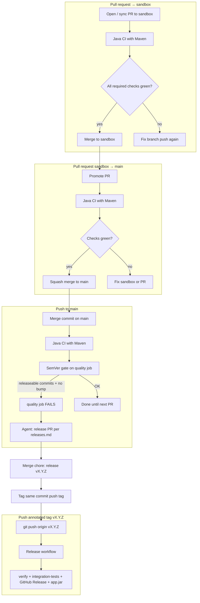

# Delivery automation map

What runs automatically on each GitHub event — **no ad-hoc “owner decides when”**. Agents and CI follow this table; humans only intervene on red gates.

## Event → workflow → next action



| Git event | Workflows triggered | SemVer gate | Agent / CI next step |
| --------- | ------------------- | ----------- | -------------------- |
| **PR** → `sandbox` | `Java CI with Maven` + `issue-link` | No | Merge when required checks green |
| **PR** → `main` (promote) | Same CI jobs | No | Merge when required checks green; body uses `Closes #N` |
| **Push** → `sandbox` | `Java CI with Maven` | No | Integrate; open promote PR when ready |
| **Push** → `main` | Same + **SemVer alignment** step in `quality` | **Yes** | If fail → open release PR ([`releases.md`](./releases.md)) |
| **Push** tag `v*.*.*` | [`Release`](../../.github/workflows/release.yml) only | N/A | Automatic GitHub Release + JAR artifact |
| Dependabot PR → `sandbox` | Same as PR → `sandbox` row | No | Review + merge to `sandbox` → promote |

VaultSpring uses **`sandbox` + `main`** ([ADR-0004](../adr/0004-git-branching-strategy-sandbox.md)). Promotion is **two PRs**, not one.

## SemVer gate (anti-drift)

Script: `scripts/check-semver-alignment.sh`

- Runs on **every push to `main`** (job `quality`) — **not** on `sandbox`.
- Requires **full git history + tags** in CI (`fetch-depth: 0` on checkout).
- **`X.Y.Z-SNAPSHOT` on `main`:** passes while releaseable commits accumulate (dev cycle); cut release via PR when ready.
- **Non-SNAPSHOT on `main`:** must be ahead of the last tag **and** have matching `CHANGELOG [X.Y.Z]` — otherwise **CI fails** (anti-drift).

Non-releaseable on their own: `chore`, `docs`, `ci`, `test`, `build`, `merge`, Dependabot `Bump …`.

## Release cadence (when to tag)

**Trigger:** `[Unreleased]` ready after a feature slice promoted to `main`, or non-SNAPSHOT `pom.xml` on `main` without matching CHANGELOG (gate red).

**Steps** (agent executes — see [`releases.md`](./releases.md)):

1. `pom.xml` → `X.Y.Z` (remove `-SNAPSHOT`)
2. Move `[Unreleased]` → `## [X.Y.Z] - YYYY-MM-DD` in `CHANGELOG.md`
3. PR `chore: release vX.Y.Z` → merge to `main`
4. `git tag -a vX.Y.Z -m "vX.Y.Z — summary"` on merge commit
5. `git push origin vX.Y.Z` → **Release workflow** publishes GitHub Release
6. Follow-up on `main`: `chore: begin X.Y.(Z+1)-SNAPSHOT` (next dev cycle)

Do **not** run `gh release create` manually when `release.yml` is enabled — the workflow owns the Release object.

## CI concurrency (why some runs look “grey”)

`maven.yml` uses:

```yaml
concurrency:
  cancel-in-progress: true
```

Several merges in seconds **cancel** older runs on the same ref. **Cancelled ≠ failed.** The latest run on the target branch must be green.

## Related

- [ADR-0004](../adr/0004-git-branching-strategy-sandbox.md)
- [`releases.md`](./releases.md)
- [`git-workflow.md`](./git-workflow.md)
- [`task-kickoff.md`](./task-kickoff.md)
- [portfolio-ecosystem.md](./portfolio-ecosystem.md) — AIOS origin links
