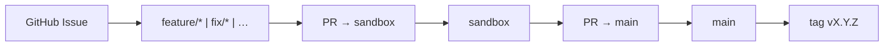

# Git Workflow — Branches, PRs, and Releases

Official delivery flow for **VaultSpring**, aligned with [AI Operating System](https://github.com/KleilsonSantos/ai-operating-system) governance — including the permanent **`sandbox`** integration branch ([ADR-0004](../adr/0004-git-branching-strategy-sandbox.md)).

## Overview

```text
feature/* | fix/* | docs/* | chore/* | ci/*
              │
              ▼  PR #1 (Refs #N)
           sandbox
              │
              ▼  PR #2 (Closes #N)
            main  →  annotated tag vX.Y.Z
```



## Permanent branches

| Branch | Role |
| ------ | ---- |
| `main` | Production line, releases, annotated SemVer tags (default branch) |
| `sandbox` | Continuous integration — all feature work merges here first |

## Canonical kickoff

Full checklist: [`task-kickoff.md`](./task-kickoff.md).

1. **Issue** on GitHub with `[feat]` / `[fix]` prefix and acceptance criteria
2. Move issue to **In Progress** (Project board, when used)
3. `git checkout sandbox && git pull origin sandbox`
4. `git checkout -b <type>/<slug>` — see [Branch prefixes](#branch-prefixes)
5. Comment on the issue with the branch name (`scripts/task-kickoff.sh` automates steps 3–5)
6. Implement → local QA → **PR #1 targeting `sandbox`** (`Refs #N` in body)
7. Merge when CI green + review → **PR #2 `sandbox` → `main`** (`Closes #N`)
8. **After merge to `main`:** SemVer gate — if releaseable commits accumulated, open **`chore: release vX.Y.Z`** PR then push tag (see [`delivery-automation.md`](./delivery-automation.md), [`releases.md`](./releases.md))

Author and Committer: **`Kleilson Santos <kleilson@icloud.com>`** — same as `pom.xml` and AIOS governance.

**Forbidden:** `Co-authored-by: Cursor` / Copilot / `cursoragent@cursor.com`; PR footers such as “Made with Cursor”. See [`attribution.md`](./attribution.md).

## Issue link enforcement

GitHub has no native branch-protection rule for “require linked issue”. VaultSpring enforces it with CI (`scripts/check-pr-issue-link.sh`):

| PR target | Required in body | Why |
| --------- | ---------------- | --- |
| `sandbox` | `Refs #N` / `#N` (issue must exist) | Work-branch gate |
| `main` (promote) | Prefer `Closes #N` / `Fixes #N` | [Closing keywords](https://docs.github.com/en/issues/tracking-your-work-with-issues/using-issues/linking-a-pull-request-to-an-issue) auto-close on the default branch |

Bypass (rare): label `ci:no-issue-required`. Dependabot PRs are skipped.

**Owner action:** mark the `issue-link` status check as **required** on `sandbox` branch protection.

## Pull requests

- Use [`.github/pull_request_template.md`](../../.github/pull_request_template.md)
- **Never** open `feature/*` directly against `main`
- One focused slice per PR when possible
- `./mvnw -B checkstyle:check test` before push when Java/XML changed

## Branch prefixes

`feature/` · `fix/` · `docs/` · `chore/` · `ci/` · `refactor/` · `test/` · `build/` · `perf/`

Examples:

- `feature/6-jwt-login`
- `fix/74-vault-dev-scripts`
- `docs/76-jwt-api-alignment`

## Commits

[Conventional Commits](https://www.conventionalcommits.org/) — **no gitmoji** in this repo:

```text
feat: add ProblemDetail handler for validation errors
fix: align Render datasource env vars with Spring Boot
docs: document task kickoff and release flow
```

Reference the issue when helpful: `feat(security): add JwtAuthenticationFilter (#6)`.

Optional **scope** (domain) after the type:

```text
feat(security): add JwtAuthenticationFilter
test(api): cover validation errors on POST /users
docs(guides): document commit granularity
ci: fetch-depth 0 for SemVer gate on main
```

Rationale for scopes: [`writing-style.md`](./writing-style.md).

## Commit granularity (branch vs PR vs commit)

| Level | Rule | Reference |
| ----- | ---- | --------- |
| **Branch** | One GitHub issue → one semantic branch from `sandbox` | [`task-kickoff.md`](./task-kickoff.md) |
| **PR #1** | Work branch → `sandbox`; `Refs #N` | This guide |
| **PR #2** | `sandbox` → `main`; `Closes #N` | [`delivery-automation.md`](./delivery-automation.md) |
| **Commit** | One logical, revertible unit; several commits per PR is best practice | Conventional Commits |

### Prefer several semantic commits — not one monolith

**Do** split by type and domain when changes are independent:

1. `ci:` / `build:` — infra that unblocks gates
2. `feat:` / `fix:` — product code
3. `test:` — tests for the feat/fix
4. `docs:` — documentation aligned to the change
5. `chore: release vX.Y.Z` — only in a release PR ([`releases.md`](./releases.md))

Each commit should pass `./mvnw -B test` when Java changed (ideal for `git bisect`).

## What NOT to do

- Commit or force-push directly to `main` or `sandbox`
- PR `feature/*` straight to `main` (skip `sandbox`)
- Merge without CI checks
- Commit secrets, `.env`, or Vault unseal material
- Bump `pom.xml` version on every feature commit (aggregate at release — see [`releases.md`](./releases.md))

## Dependabot

Configured in [`.github/dependabot.yml`](../../.github/dependabot.yml).

| Kind | Target branch | Notes |
| ---- | ------------- | ----- |
| **Version updates** | `sandbox` | Review → merge to `sandbox` → promote to `main` |
| **Security alerts** | n/a (Security tab) | Review alerts; do not rely on auto security-update PRs to `main` if version updates target `sandbox` |

## Related

- [ADR-0004](../adr/0004-git-branching-strategy-sandbox.md)
- [`docs/README.md`](../../docs/README.md)
- [`writing-style.md`](./writing-style.md)
- [`task-kickoff.md`](./task-kickoff.md)
- [`releases.md`](./releases.md)
- [`CONTRIBUTING.md`](../../CONTRIBUTING.md)
- AIOS reference: [git-workflow](https://github.com/KleilsonSantos/ai-operating-system/blob/main/docs/guides/git-workflow.md)
