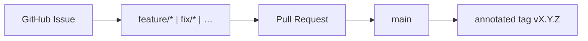

# Git Workflow — Branches, PRs, and Releases

Official delivery flow for **VaultSpring**, aligned with [AI Operating System](https://github.com/KleilsonSantos/ai-operating-system) governance patterns and adapted to this repository (single integration branch: `main`).

## Overview



Unlike AIOS, VaultSpring does **not** use a `sandbox` branch. Work branches merge directly into `main` after review and CI.

## Permanent branches

| Branch | Role |
| ------ | ---- |
| `main` | Production line, releases, annotated SemVer tags |

## Canonical kickoff

Full checklist: [`task-kickoff.md`](./task-kickoff.md).

1. **Issue** on GitHub with `[feat]` / `[fix]` prefix and acceptance criteria
2. Move issue to **In Progress** (Project board, when used)
3. `git checkout main && git pull origin main`
4. `git checkout -b <type>/<slug>` — see [Branch prefixes](#branch-prefixes)
5. Comment on the issue with the branch name (`scripts/task-kickoff.sh` automates steps 3–5)
6. Implement → local QA → PR targeting `main`
7. Merge when CI green + review; release when [`releases.md`](./releases.md) criteria met

Author: `Kleilson Santos <kleilson@icloud.com>`. Do **not** add IDE co-authorship trailers (`Co-authored-by: Cursor`).

## Pull requests

- Use [`.github/pull_request_template.md`](../../.github/pull_request_template.md)
- Link issues: `Closes #N` in the PR body
- One focused slice per PR when possible
- `./mvnw -B checkstyle:check test` before push when Java/XML changed

## Branch prefixes

`feature/` · `fix/` · `docs/` · `chore/` · `ci/` · `refactor/` · `test/` · `build/` · `perf/`

Examples:

- `feature/50-problemdetail-openapi`
- `fix/42-actuator-health-probe`
- `docs/52-delivery-governance`

## Commits

[Conventional Commits](https://www.conventionalcommits.org/) — **no gitmoji** in this repo:

```text
feat: add ProblemDetail handler for validation errors
fix: align Render datasource env vars with Spring Boot
docs: document task kickoff and release flow
```

Reference the issue when helpful: `feat: add UserApiIT (#51)`.

## What NOT to do

- Commit or force-push directly to `main`
- Merge without CI checks
- Commit secrets, `.env`, or Vault unseal material
- Bump `pom.xml` version on every feature commit (aggregate at release — see [`releases.md`](./releases.md))

## Dependabot

Configured in [`.github/dependabot.yml`](../../.github/dependabot.yml). Version updates target `main`. Review security alerts in the GitHub Security tab.

## Related

- [`docs/README.md`](../../docs/README.md)
- [`task-kickoff.md`](./task-kickoff.md)
- [`releases.md`](./releases.md)
- [`CONTRIBUTING.md`](../../CONTRIBUTING.md)
- AIOS reference: [git-workflow](https://github.com/KleilsonSantos/ai-operating-system/blob/main/docs/guides/git-workflow.md)
