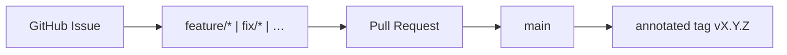
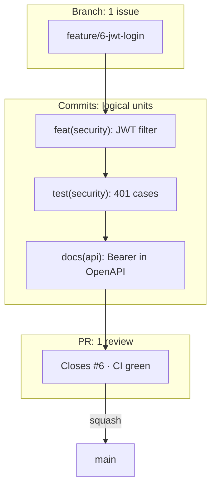

# Git Workflow — Branches, PRs, and Releases

Official delivery flow for **VaultSpring**, aligned with [AI Operating System](https://github.com/KleilsonSantos/ai-operating-system) governance patterns and adapted to this repository (single integration branch: `main`).

## Overview



Unlike AIOS, VaultSpring does **not** use a `sandbox` branch. Work branches merge directly into `main` after review and CI.

## Permanent branches

| Branch | Role |
| ------ | ---- |
| `main` | Production line, releases, annotated SemVer tags |

## Canonical kickoff

Full checklist: [`task-kickoff.md`](./task-kickoff.md).

1. **Issue** on GitHub with `[feat]` / `[fix]` prefix and acceptance criteria
2. Move issue to **In Progress** (Project board, when used)
3. `git checkout main && git pull origin main`
4. `git checkout -b <type>/<slug>` — see [Branch prefixes](#branch-prefixes)
5. Comment on the issue with the branch name (`scripts/task-kickoff.sh` automates steps 3–5)
6. Implement → local QA → PR targeting `main`
7. Merge when CI green + review
8. **After merge to `main`:** CI runs SemVer gate — if releaseable commits accumulated, open **`chore: release vX.Y.Z`** PR then push tag (see [`delivery-automation.md`](./delivery-automation.md), [`releases.md`](./releases.md))

Author and Committer: **`Kleilson Santos <kleilson@icloud.com>`** — same as `pom.xml` and AIOS governance.

**Forbidden:** `Co-authored-by: Cursor` / Copilot / `cursoragent@cursor.com`; PR footers such as “Made with Cursor”. See [`attribution.md`](./attribution.md).

## Pull requests

- Use [`.github/pull_request_template.md`](../../.github/pull_request_template.md)
- Link issues: `Closes #N` in the PR body
- One focused slice per PR when possible
- `./mvnw -B checkstyle:check test` before push when Java/XML changed

## Branch prefixes

`feature/` · `fix/` · `docs/` · `chore/` · `ci/` · `refactor/` · `test/` · `build/` · `perf/`

Examples:

- `feature/50-problemdetail-openapi`
- `fix/42-actuator-health-probe`
- `docs/52-delivery-governance`

## Commits

[Conventional Commits](https://www.conventionalcommits.org/) — **no gitmoji** in this repo:

```text
feat: add ProblemDetail handler for validation errors
fix: align Render datasource env vars with Spring Boot
docs: document task kickoff and release flow
```

Reference the issue when helpful: `feat: add UserApiIT (#51)`.

Optional **scope** (domain) after the type — [Conventional Commits](https://www.conventionalcommits.org/en/v1.0.0/#commit-message-with-scope):

```text
feat(security): add JwtAuthenticationFilter
test(api): cover validation errors on POST /users
docs(guides): document commit granularity
ci: fetch-depth 0 for SemVer gate on main
```

Rationale for scopes: [`writing-style.md`](./writing-style.md).

## Commit granularity (branch vs PR vs commit)

Three levels — do not confuse them:

| Level | Rule | Reference |
| ----- | ---- | --------- |
| **Branch** | One GitHub issue → one semantic branch | [`task-kickoff.md`](./task-kickoff.md) |
| **PR** | One focused slice; squash merge to `main` is normal | This guide — “One focused slice per PR” |
| **Commit** | One **logical**, revertible unit; several commits per PR is best practice | [Conventional Commits](https://www.conventionalcommits.org/) |



### Prefer several semantic commits — not one monolith

**Do** split by type and domain when changes are independent:

1. `ci:` / `build:` — infra that unblocks gates  
2. `feat:` / `fix:` — product code  
3. `test:` — tests for the feat/fix  
4. `docs:` — documentation aligned to the change  
5. `chore: release vX.Y.Z` — only in a release PR ([`releases.md`](./releases.md))

Each commit should pass `./mvnw -B test` when Java changed (ideal for `git bisect`).

**Avoid** a single commit mixing unrelated `feat` + `ci` + `docs` + release prep.

**One commit is OK** when the PR is tiny (single typo, one-line fix) or a cohesive release commit (`chore: release v0.1.4`).

### Squash merge does not forbid granular commits

PRs merge with **squash** → `main` often shows one commit per PR. Granular commits on the branch still help **review**, **bisect** on the branch, and **SemVer** classification before squash ([`releases.md`](./releases.md) — do not bump `pom.xml` on every feature commit).

## What NOT to do

- Commit or force-push directly to `main`
- Merge without CI checks
- Commit secrets, `.env`, or Vault unseal material
- Bump `pom.xml` version on every feature commit (aggregate at release — see [`releases.md`](./releases.md))

## Dependabot

Configured in [`.github/dependabot.yml`](../../.github/dependabot.yml). Version updates target `main`. Review security alerts in the GitHub Security tab.

## Related

- [`docs/README.md`](../../docs/README.md)
- [`writing-style.md`](./writing-style.md)
- [`task-kickoff.md`](./task-kickoff.md)
- [`releases.md`](./releases.md)
- [`CONTRIBUTING.md`](../../CONTRIBUTING.md)
- AIOS reference: [git-workflow](https://github.com/KleilsonSantos/ai-operating-system/blob/main/docs/guides/git-workflow.md)
