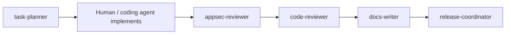

# GitHub Copilot custom agents

VaultSpring ships specialized agents under [`.github/agents/`](../../.github/agents/) for consistent, least-privilege assistance next to the code.

Always-on instructions: [`.github/copilot-instructions.md`](../../.github/copilot-instructions.md) · routing: [`AGENTS.md`](../../AGENTS.md).

Official reference: [Creating custom agents](https://docs.github.com/en/copilot/how-tos/copilot-on-github/customize-copilot/customize-cloud-agent/create-custom-agents).

## Agent catalog

| Agent | File | Tools | Purpose |
| ----- | ---- | ----- | ------- |
| **task-planner** | `task-planner.agent.md` | read, search | Issue/PR plan — no implementation |
| **code-reviewer** | `code-reviewer.agent.md` | read, search | PR/diff review (Spring, CI, secrets) |
| **docs-writer** | `docs-writer.agent.md` | read, search, edit | README, CHANGELOG, HELP aligned to code |
| **appsec-reviewer** | `appsec-reviewer.agent.md` | read, search | AppSec checklist, JWT, RBAC, Vault |
| **release-coordinator** | `release-coordinator.agent.md` | read, search | SemVer release train — no auto-commit |

## Recommended workflow

Use **handoffs** (where your client supports them) to move between agents without losing context.

## Design rules

1. **Unique purpose** — one agent, one job; no generic “do everything” agent
2. **Least privilege** — restrict `tools`; reviewers are read-only
3. **Code wins** — never document MapStruct, Boot 4, or stack not in `pom.xml`
4. **No secret leakage** — agents must not echo `.env` or tokens in outputs
5. **Attribution** — no IDE co-author trailers ([`attribution.md`](./attribution.md))
6. **PKB for long prompts** — catalog in [`docs/prompts/`](../prompts/README.md), do not duplicate in agent bodies

## Adding an agent

1. Create `.github/agents/<name>.agent.md` (lowercase, hyphens)
2. YAML frontmatter: `name`, `description`, `tools` (required for restricted agents)
3. Body: contract, mission, checklist, response format
4. Update this catalog in the same PR
5. PR → `sandbox` with `Refs #N`

## Related

- [`github-projects.md`](./github-projects.md) — delivery board
- [`github-wiki-policy.md`](./github-wiki-policy.md) — wiki is not SSOT
- [`local-runtime-authorization.md`](./local-runtime-authorization.md) — infra gate
