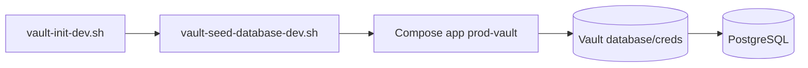

# Vault integration (local Compose)

How to run VaultSpring with **HashiCorp Vault Database Secrets Engine** for dynamic PostgreSQL credentials. Production on Render uses env vars only — see [ADR-0002](../adr/0002-datasource-via-vault-or-env.md).

Decision record: [ADR-0005](../adr/0005-dynamic-postgresql-credentials-vault.md) · Configuration reference: [configuration.md](../configuration.md).

## Prerequisites

- Docker Compose (Postgres + Vault services)
- `.env` from [`.env.example`](../../.env.example) — never commit secrets
- Vault CLI optional (scripts fall back to `docker exec` into the Vault container)

## Flow overview



## Step 1 — Start infrastructure

```bash
cp .env.example .env
docker compose up -d postgres vault
```

Wait until Vault and Postgres are healthy (`docker compose ps`).

## Step 2 — Initialize and unseal Vault

Run once per fresh Vault data volume:

```bash
bash scripts/vault-init-dev.sh
export VAULT_TOKEN=$(cat target/vault-dev-root-token.txt)
```

The root token is written to `target/vault-dev-root-token.txt` (gitignored). Add `VAULT_TOKEN` to `.env` for Compose.

If Vault is already initialized but sealed, unseal manually with your unseal key — the init script exits with instructions.

## Step 3 — Configure Database Secrets Engine

```bash
export VAULT_ADDR=http://127.0.0.1:8200
# VAULT_TOKEN already exported from step 2
bash scripts/vault-seed-database-dev.sh
```

This script:

- Enables the `database` secrets engine (if missing)
- Creates config `database/config/vaultspring-postgresql` pointing at Compose Postgres
- Creates role `vaultspring-app` (`default_ttl=1h`, `max_ttl=24h`)

Override role name with `VAULT_DB_ROLE` (must match `application-vault.yml`).

`vault-seed-dev.sh` is an alias that delegates to `vault-seed-database-dev.sh`.

## Step 4 — Start the application

```bash
docker compose up -d app   # SPRING_PROFILES_ACTIVE=prod-vault by default
```

Or locally with Maven:

```bash
export SPRING_PROFILES_ACTIVE=vault
export VAULT_ADDR=http://127.0.0.1:8200
export VAULT_TOKEN=<token>
export POSTGRES_URL=jdbc:postgresql://localhost:5432/users_db
./mvnw spring-boot:run
```

Spring Cloud Vault populates `spring.datasource.username` and `spring.datasource.password` from `database/creds/vaultspring-app`. JDBC URL comes from env/YAML, not Vault KV.

## Lease lifecycle

`application-vault.yml` enables lease renewal (`spring.cloud.vault.config.lifecycle`). Vault renews credentials until `max_ttl`. At terminal expiry, `VaultDatabaseCredentialRotation` requests new credentials and soft-evicts the HikariCP pool without restart (ADR-0005 Phase 2).

Metric: `vaultspring.vault.database.rotation.total` (`result=success|failure`).

## Verify

```bash
curl -s http://localhost:8080/actuator/health
# Login + API smoke:
bash scripts/api-live-smoke.sh
```

Integration tests (CI): `VaultDatabaseSecretsIT` (create → use → renew), `VaultDatabaseCredentialRotationIT` (rotation after short `max_ttl`).

## Troubleshooting

| Symptom | Check |
| ------- | ----- |
| `fail-fast` on startup | `VAULT_TOKEN` set, Vault unsealed, seed script ran |
| `permission denied` on DB | Re-run `vault-seed-database-dev.sh`; confirm Postgres admin credentials in `.env` |
| App uses static admin user | Wrong profile — need `vault` or `prod-vault`, not `dev` alone |
| Lease expired / auth failures | Check metric `vaultspring.vault.database.rotation.total`; verify `VaultDatabaseCredentialRotation` logs; confirm Vault role TTL |

Never commit `.env`, root tokens, or unseal keys. Compose Vault is **local infrastructure only**.

## Related

- [development.md](../development.md) — full local workflow
- [architecture.md](../architecture.md) — datasource paths diagram
- [SECURITY.md](../../SECURITY.md) — reporting and repo posture
